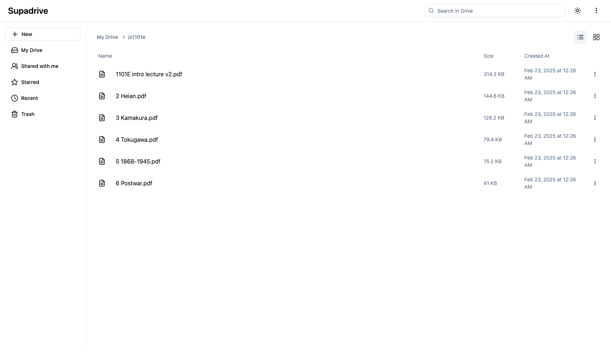

# SupaDrive

<div align="center">
  
</div>

A modern file storage and management system built with React, Supabase, and TailwindCSS.

## Key Features

-   📁 File and folder management
-   🔄 Drag and drop file upload
-   📱 Responsive grid and list views
-   🔍 File search capabilities
-   🌓 Light/dark mode support
-   🗑️ File deletion
-   ⬇️ Direct file downloads
-   📂 Nested folder navigation

## Tech Stack

-   React + TypeScript
-   Supabase (Storage + Database)
-   TailwindCSS
-   Radix UI Components
-   Vite

## Quick Start

1. Clone the repository:

```bash
git clone https://github.com/yourusername/supadrive.git
cd supadrive
```

2. Install dependencies:

```bash
npm install
```

3. Create a `.env` file in the root directory:

```bash
VITE_SUPABASE_URL=your_supabase_url
VITE_SUPABASE_KEY=your_supabase_key
```

4. Start the development server:

```bash
npm run dev
```

## Supabase Setup

1. Create a new Supabase project
2. Create the following tables:
    - `files` (id, name, path, folder_id, size, url, created_at)
    - `folders` (id, name, parent_id, created_at)
3. Enable Storage and create a bucket named `my-bucket`
4. Set up storage policies for public access

## Todos

Future improvements and features planned for SupaDrive:

### High Priority

-   [ ] Implement folder routing in URL (e.g., `/folder/123/subfolder/456`)
-   [ ] Add favorites functionality
-   [ ] Implement file preview for common formats
